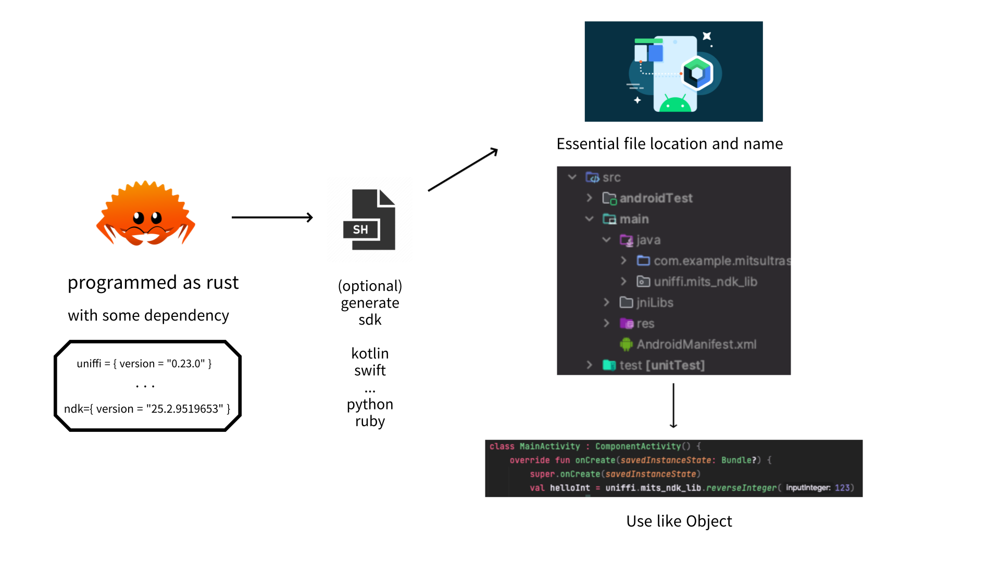

# MITS 멀티플랫폼 SDK 빌드 시스템

[](https://github.com/INJE-MITS/mits-rust-multiplatform-sdk/actions/workflows/rust.yml)

인제대학교 의료 초음파 연구실([MITS LAB](https://github.com/INJE-MITS))의 고성능 신호처리 메소드를 **Rust 한 곳에 구현하고, 여러 언어·플랫폼용 네이티브 바인딩을 자동 생성**하기 위한 빌드 시스템입니다. 연구실의 Android 초음파 앱이 첫 번째 소비자이며, 같은 코어를 Python·Swift·Wasm에서도 그대로 쓰는 것이 목표입니다.

> 현재 공개된 코어 메소드는 파이프라인을 검증하기 위한 자리표시자(문자열·정수 뒤집기)입니다. 실제 신호처리 메소드는 관련 연구의 공개 시점에 맞춰 교체됩니다.

## Flow



Rust로 메소드를 작성하고(uniffi·ndk 의존성), 빌드 스크립트가 Kotlin·Swift·Python 등의 SDK를 생성해 앱 프로젝트의 정해진 위치(`jniLibs/`, `java/uniffi/`)에 놓으면, 앱에서는 `uniffi.mits_ndk_lib.reverseInteger(123)`처럼 일반 객체 호출로 씁니다.

## 구조

```
src/
  lib.rs                     # 공개 API. uniffi scaffolding 포함
  mits_ndk_lib.udl           # FFI 계약 (UniFFI Definition Language)
  signal_processing/         # 신호처리 메소드 모듈
build.rs                     # UDL → Rust scaffolding 생성
uniffi-bindgen.rs            # 바인딩 생성기 진입점 (cargo run --bin uniffi-bindgen)
build.sh                     # Android 4 ABI 빌드 → jniLibs + Kotlin 바인딩 → 앱 프로젝트 주입
jniLibs/                     # arm64-v8a · armeabi-v7a · x86 · x86_64 산출물
uniffi/mits_ndk_lib/         # 생성된 Kotlin 바인딩
.github/workflows/rust.yml   # CI: cargo build --lib
```

동작 원리는 세 단계입니다.

1. `mits_ndk_lib.udl`에 함수 시그니처를 선언한다.
2. `build.rs`가 빌드 시점에 UDL을 읽어 Rust 쪽 scaffolding을 생성하고, `lib.rs`가 이를 포함한다(`crate-type = ["cdylib"]`).
3. `uniffi-bindgen`이 같은 UDL에서 대상 언어의 바인딩을 생성한다. 현재 `build.sh`는 Kotlin을 생성하며 `--language`만 바꾸면 Python·Swift로 확장된다.

## 지원 대상

| 대상 | 상태 |
|---|---|
| Kotlin (Android, 4 ABI) | 지원 · `build.sh` |
| Python · Swift | uniffi 바인딩 생성 가능, 빌드 스크립트 미정리 |
| Wasm | 계획 |

## 빌드

```bash
rustup target add aarch64-linux-android armv7-linux-androideabi i686-linux-android x86_64-linux-android
# build.sh 상단의 ANDROID_PROJECT_MAIN_PATH를 대상 앱의 src/main 경로로 바꾼 뒤
./build.sh
cargo test
```

| 도구 | 버전 |
|---|---|
| Rust | 1.75 |
| uniffi | 0.25.3 |

## 설계 원칙

- Rust 메소드가 마지막 계층에서 호스트 언어의 내장 함수를 콜백으로 호출하는 구조를 피합니다. 호스트에서 값을 넘겨받아 Rust 안에서 끝내고, 결과를 다음 Rust 메소드에 그대로 넘기는 흐름을 유지합니다.

```python
# 지양: 호스트 언어 안에서 함수끼리 연결
def a():
    return b()

# 지향: SDK 메소드 사이로 값을 계속 넘김
x = rusted_a()
rusted_b(x)
```

- 바인딩은 손으로 고치지 않습니다. UDL을 바꾸고 다시 생성합니다.

## 예정

- UDL 자동 작성기 (Rust 함수 시그니처에서 UDL 생성)
- Tauri 기반 데스크톱 앱 CI/CD
- JNI 비동기 처리 자동 빌드

## 관리

윤상현 ([@sxngt](https://github.com/sxngt)) · MITS LAB
